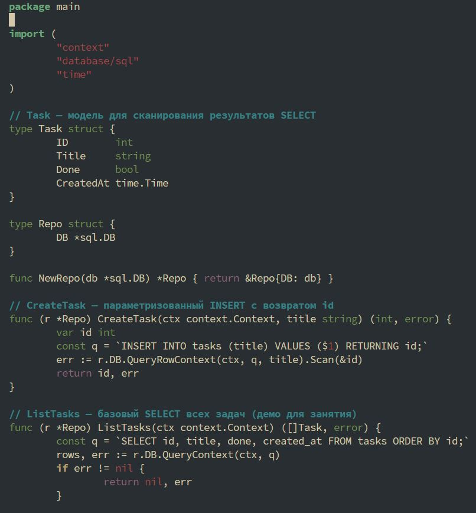

## Подключение к PostgreSQL через database/sql. Выполнение простых запросов (INSERT, SELECT)

Студент группы *ЭФМО-02-25 Пягай Даниил Игоревич*

## Описание

**Цели:**

1.	Установить и настроить PostgreSQL локально.
2.	Подключиться к БД из Go с помощью database/sql и драйвера PostgreSQL.
3.	Выполнить параметризованные запросы INSERT и SELECT.
4.	Корректно работать с context, пулом соединений и обработкой ошибок.

## Открываем postgres и создаём базу данных (Linux)


### Создаём таблицу


### Выполняем быстрый тест


## Инициализация проекта

```bash
mkdir pz5-db && cd pz5-db
go mod init pz5-db
go get github.com/jackc/pgx/v5/stdlib
go get github.com/joho/godotenv
```

### Создаём структуру файлов


### Содержимое db.go


### Содержимое repository.go


### Содержимое main.go (фрагмент)
.JPG)
.JPG)

### Запуск и проверка

## Ожидаемый лог был получен

### Результаты выполнения проверочный заданий


### Обновить (статус первого задания меняем с false на true)


### Проверяем изменение

